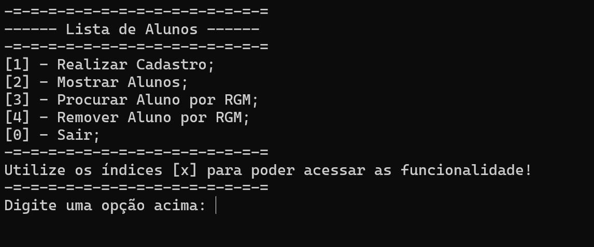
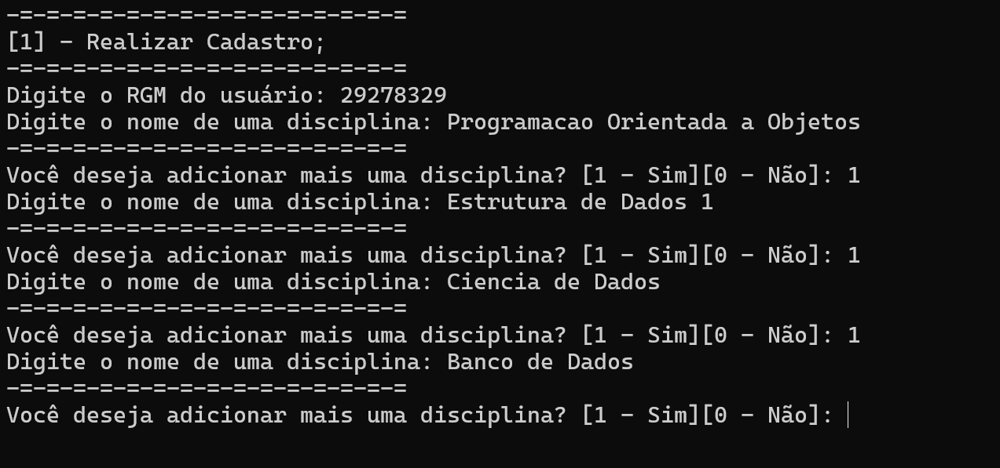
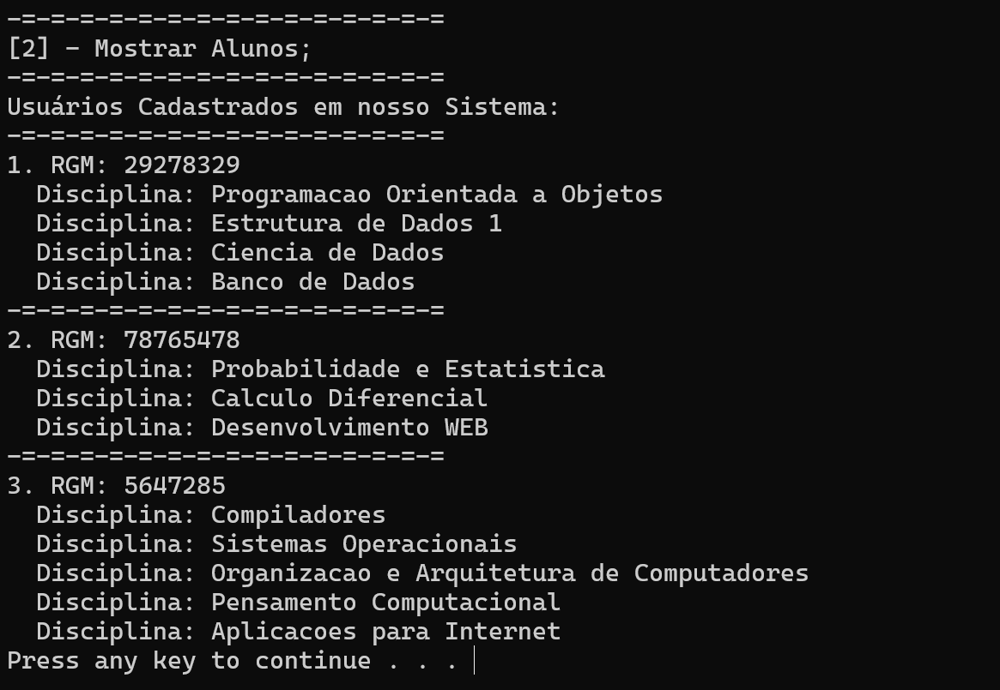
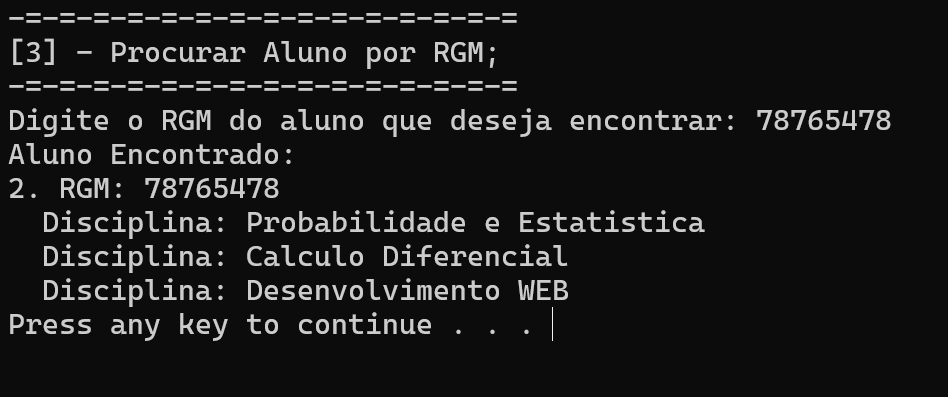

# Locadora de Veiculos

Aplicação que envolve conceitos de listas sequencias e encadeadas, em contexto de um programa que armazena informações sobre estudantes. Um projeto realizado por um grupo de alunos cursando o 3º período da faculdade de Ciência da Computação na UNIPÊ:

## 📌 Integrantes envolvidos no projeto:

 - [Cauã Augusto Machado de Negreiros](https://github.com/cauaaugustow)
 - [Lucca de Sena Barbosa](https://github.com/luccasena)

## 📌 Imagens Demonstrativas do Algoritmo: 

### 1. Menu:

### 2. Registro de aluno:

### 3. Mostrar alunos registrados:

### 4. Mostrar alunos registrados por RGM:

